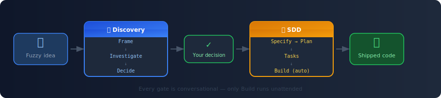
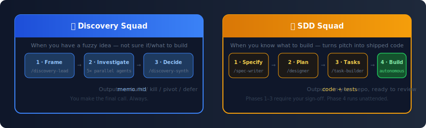
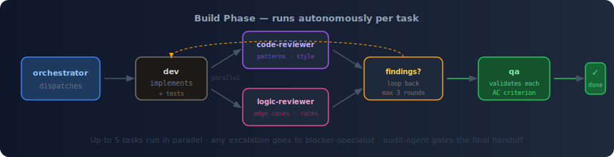
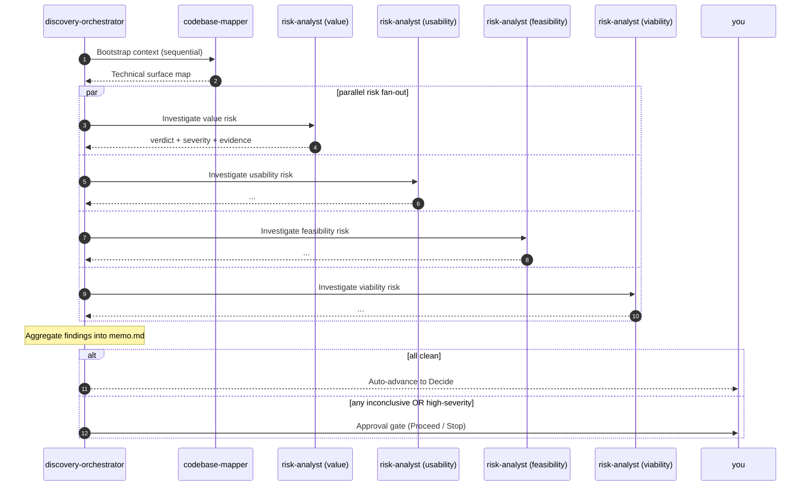

# ai-squad

     

> **A structured workflow for AI-assisted development — from fuzzy idea to shipped code.**
>
> AI coding tools are powerful but unstructured. ai-squad adds the missing layer: interactive spec gates, parallel autonomous review, and a mechanical audit trail — so you stay in control of every decision while the agents do the heavy lifting.

<br/>



<br/>

---

## The Problem

Working with AI on a real feature without a workflow tends to go like this:

- 🔁 **You re-explain context every session** — the AI doesn't remember yesterday's decision.
- 🎯 **The output doesn't quite match what you meant** — because "what you meant" was never written down.
- ❓ **"Should we even build this?"** — that question gets skipped, and careful code ships for nobody.

ai-squad gives you two squads to cover both layers: one to validate the *idea*, one to build the *feature*.

---

## Two Squads, Two Jobs



<br/>

| Your situation | Squad to use |
|---|---|
| 🤔 Fuzzy idea — not sure if/what to build | **Discovery** — Frame → Investigate → Decide |
| 🎯 Clear pitch — ready to build | **SDD** — Specify → Plan → Tasks → Build |
| 🔁 Discovery said "Proceed" — now build it | Read the memo, compose a pitch, then **SDD** |
| ❌ Discovery said "Kill" | `/ship DISC-NNN` to clean up |

> **Why isn't the chain automatic?** Discovery memos can sit for weeks before delivery starts. Auto-feeding them silently propagates stale assumptions. Re-reading is your freshness check — quick, but deliberate.

---

## How the Build Phase Works

The first three phases of SDD are conversational — you write the spec, approve the architecture, and break it into tasks. Once you approve the task list, **Phase 4 runs unattended**:



<br/>

- **dev** implements each task, test-first, inside an isolated context
- **code-reviewer** and **logic-reviewer** run in parallel — patterns/style vs edge cases/races
- Findings loop back to **dev** (max 3 rounds) until reviewers sign off
- **qa** validates every acceptance criterion against the spec
- **audit-agent** reconciles the dispatch manifest before the final handoff — refuses to hand off if the pipeline was bypassed
- If anything escalates beyond the caps, **blocker-specialist** writes a decision memo or escalates to you

Up to 5 tasks run in parallel. One task escalating doesn't block the others.

---

## What You Stay In Control Of

ai-squad never merges, never commits, never sends output silently. At every gate, you read and approve:

| Phase | What you approve |
|---|---|
| Specify | The feature spec (problem statement, user stories, acceptance criteria) |
| Plan | The architecture and design decisions |
| Tasks | The granular task breakdown before any code runs |
| Handoff | `git diff` / `git status` — you commit when you're satisfied |

The audit-agent ensures the pipeline wasn't bypassed — every task must produce a verifiable output packet before handoff is granted.

---

## What to Expect

<!-- TODO: populate this section with real cost and timeline data once we have a representative round of sessions with full cost instrumentation enabled. For now, track your own sessions with `npx @ai-squad/agentops report`. -->

**Pipeline health metrics tracked out of the box (via agentops):**

- ✅ AC closure rate (pass / partial / fail / missing per acceptance criterion)
- ✅ Dev task success rate (first-try vs looped)
- ✅ Escalation rate (healthy band: < 10%)
- ✅ Reviewer findings density (critical / major / minor)
- ✅ Token usage and estimated cost per dispatch (when hooks are wired)
- ✅ Wall-clock duration per phase

After any SDD session, run `npx @ai-squad/agentops report` to generate `docs/agentops/index.html` with the full breakdown.

---

## Install

**Requirements:** Node ≥ 18, Python 3.8+ on `PATH`. You use **Claude Code**, **Cursor**, or **Kiro** as the agent host — or any combination.

### npm (recommended)

```bash
npm i -g @ai-squad/cli @ai-squad/agentops

ai-squad deploy                    # all squads → ~/.claude/   (Claude Code)
# or: ai-squad deploy --squad sdd
# or: ai-squad deploy --cursor     # also mirror hooks to ~/.cursor/
```

After deploy, start with `/spec-writer "<your pitch>"` or `/discovery-lead "<your problem signal>"` in any project.

```bash
# After running an SDD pipeline
npx @ai-squad/agentops report      # writes docs/agentops/index.html
```

### From source (contributors / Cursor / Kiro)

```bash
git clone https://github.com/<your-handle>/ai-squad.git
cd ai-squad

./tools/deploy.sh                  # Claude Code
./tools/deploy-cursor.sh           # Cursor
./tools/deploy-kiro.sh             # Kiro
```

---

## Quick Reference

### 🎯 Discovery

| You run | What happens | Phase |
|---|---|---|
| `/discovery-lead "<problem>"` | Interactive interview → 1-pager | 1 — Frame |
| `/discovery-orchestrator DISC-NNN` | 5 background analyses in parallel (codebase map + 4 risk analysts) | 2 — Investigate |
| `/discovery-synthesizer DISC-NNN` | Options table + recommendation. You decide. | 3 — Decide |

### 🚢 SDD

| You run | What happens | Phase |
|---|---|---|
| `/spec-writer "<pitch>"` | Interactive spec: problem, user stories, acceptance criteria | 1 — Specify |
| `/designer FEAT-NNN` | Architecture and design decisions | 2 — Plan |
| `/task-builder FEAT-NNN` | Break the plan into granular tasks | 3 — Tasks |
| `/orchestrator FEAT-NNN` | Autonomous build: dev → reviewers → qa → handoff | 4 — Build |

Each phase auto-advances after your approval — no need to copy-paste IDs between commands.

---

<details>
<summary><b>👥 The team — 15 specialists across 2 squads</b></summary>

<br/>

**🎯 Discovery squad — 5 Roles:**

| Role | Phase | What it owns |
|---|---|---|
| **discovery-lead** | 1 — Frame | Drafting the 1-pager interactively with you |
| **discovery-orchestrator** | 2 — Investigate | Dispatching codebase-mapper + 4× risk-analyst |
| **codebase-mapper** | 2 | Read-only "code spelunking" producing a map of the technical surface |
| **risk-analyst** | 2 | One instance per Cagan Big Risk (value / usability / feasibility / viability) |
| **discovery-synthesizer** | 3 — Decide | Options table + recommendation; you make the call |

**🚢 SDD squad — 10 Roles:**

| Role | Phase | What it owns |
|---|---|---|
| **spec-writer** | 1 — Specify | Turning your pitch into an approved Spec |
| **designer** | 2 — Plan | Turning the Spec into a Plan (architecture, data, API, UX, risks) |
| **task-builder** | 3 — Tasks | Turning the Plan into granular tasks |
| **orchestrator** | 4 — Build | Dispatching workers in parallel, emitting one handoff |
| **dev** | 4 | Implementing one task, test-first |
| **code-reviewer** | 4 | Patterns, style, naming, architectural fit |
| **logic-reviewer** | 4 | Edge cases, race conditions, missing flows |
| **qa** | 4 | Validating each acceptance criterion is actually satisfied |
| **blocker-specialist** | 4 (escalation) | Resolving blockers via decision memo, or escalating to you |
| **audit-agent** | 4 (pre-handoff gate) | Reconciling the dispatch manifest against actual outputs |

</details>

<details>
<summary><b>⚙️ Host compatibility — Claude Code · Cursor · Kiro</b></summary>

<br/>

Claude Code is the **source of truth**. Cursor and Kiro are translations via dedicated deploy scripts.

| Capability | Claude Code | Cursor | Kiro CLI/IDE |
|---|---|---|---|
| **Skill invocation** | `/spec-writer`, `/discovery-lead`, … | `/<name>`, `@<name>`, picker | `kiro-cli --agent <name>` · `/agent` picker |
| **Subagent dispatch** | `Task` tool, parallel fan-out | sequential (depends on build) | `delegate` tool, parallel |
| **`block-git-write`** | ✅ orchestrator only | ✅ global | ✅ orchestrator only |
| **`verify-audit-dispatch`** | ✅ orchestrator only | ✅ global | ✅ orchestrator only |
| **`verify-output-packet`** | ✅ each Subagent | ✅ global | ✅ each agent |
| **`guard-session-scope`** | ✅ orchestrator only | ❌ omitted (would block `dev`) | ✅ orchestrator only |

**Functional coverage**: Claude Code 100% · Cursor ~90% · Kiro ~95%  
**Mechanical coverage (hooks)**: Claude Code 4/4 · Cursor 3/4 · Kiro 4/4

> If you need full mechanical enforcement outside Claude Code, prefer Kiro — its per-agent hook model lets `guard-session-scope` fire only for the orchestrator.

**Deploy scripts:**

| Script | Host |
|---|---|
| [`./tools/deploy.sh`](tools/deploy.sh) | Claude Code |
| [`./tools/deploy-cursor.sh`](tools/deploy-cursor.sh) | Cursor |
| [`./tools/deploy-kiro.sh`](tools/deploy-kiro.sh) | Kiro |

</details>

<details>
<summary><b>📂 Repo layout</b></summary>

<br/>

```
squads/
  discovery/        🎯 Discovery squad (Frame → Investigate → Decide)
    skills/         3 conversational Skills
    agents/         2 autonomous Subagents
  sdd/              🚢 SDD squad (Specify → Plan → Tasks → Build)
    skills/         4 conversational Skills
    agents/         6 autonomous Subagents (incl. audit-agent)
    hooks/          7 Python hooks
packages/
  cli/              @ai-squad/cli — `ai-squad deploy` CLI
  agentops/         @ai-squad/agentops — session reports
shared/             Cross-squad schemas, glossary, concepts
examples/           Worked examples (one per squad)
docs/               Inspirations, operational model, design specs
scripts/            smoke-walkthrough.sh and export smoke tests
tools/              deploy scripts + converters
```

</details>

<details>
<summary><b>🔍 Discovery Investigate phase — sequential bootstrap, then parallel risk fan-out</b></summary>

<br/>



`inconclusive` is a first-class outcome, not an error. Each risk-analyst can return `N/A` when a risk doesn't apply (e.g. `viability` for internal tooling).

</details>

---

## Learn More

- 📖 [`docs/inspirations.md`](docs/inspirations.md) — the industry sources that shaped each decision
- 🔧 [`docs/operational-model.md`](docs/operational-model.md) — recommended models per phase, permissions, state persistence
- 📚 [`shared/glossary.md`](shared/glossary.md) — canonical vocabulary (Role, Skill, Subagent, Output Packet, Work Packet…)
- 🚢 [`examples/sdd-FEAT-001-fake/`](examples/sdd-FEAT-001-fake/) — end-to-end SDD worked example
- 🎯 [`examples/discovery-DISC-001-fake/`](examples/discovery-DISC-001-fake/) — end-to-end Discovery worked example

## Verify the Pipeline

```bash
./scripts/smoke-walkthrough.sh   # 59 checks across both squads — all pass
```

## Contributing

PRs welcome. Before opening: `./scripts/smoke-walkthrough.sh` must PASS, `./scripts/smoke-cursor-export.sh` must PASS, `./scripts/smoke-kiro-export.sh` must PASS, and `./tools/deploy.sh` must report no length-budget warnings.

---

[MIT](LICENSE) — © 2026 Gabriel Andrade
