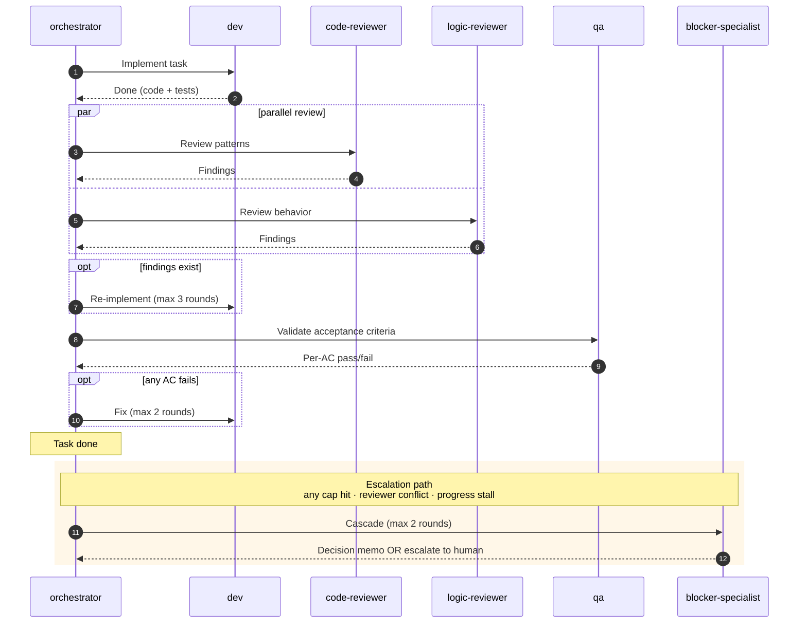
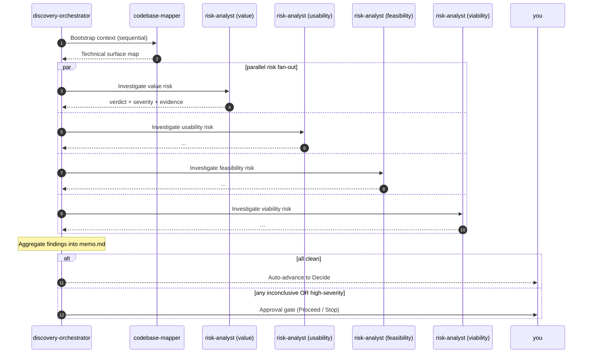

# ai-squad

   

> An opinionated multi-squad pipeline for [Claude Code](https://claude.com/claude-code).
>
> **Two squads ship today. You bring the problem signal or the pitch, ai-squad runs the right squad — pausing for your sign-off at every gate.**

```mermaid
flowchart LR
    Signal([Fuzzy problem]) --> DF
    Pitch([Clear pitch]) --> SS

    subgraph Discovery [<b>Discovery squad</b> — fuzzy → decision]
        DF[<b>Frame</b><br/>Cagan Q1-Q9]
        DI[<b>Investigate</b><br/>4× risk-analyst]
        DD[<b>Decide</b><br/>options + recommendation]
        DF --> DI --> DD
    end

    subgraph SDD [<b>SDD squad</b> — pitch → shipped code]
        SS[<b>Specify</b><br/>spec.md]
        SP[<b>Plan</b><br/>plan.md]
        ST[<b>Tasks</b><br/>tasks.md]
        SB[<b>Build</b><br/>code + tests]
        SS --> SP --> ST --> SB
    end

    DD -.you read memo.<br/>recompose pitch.-> SS
    SB --> Done([Handoff])

    classDef interactive fill:#e3f2fd,stroke:#1976d2,color:#000
    classDef autonomous fill:#fff3e0,stroke:#f57c00,color:#000
    class DF,DI,DD,SS,SP,ST interactive
    class SB autonomous
```

Every gate is conversational. Only SDD's Build phase runs unattended.

---

## Why

Working with AI on a real feature without a workflow is messy:

- You re-prompt the same context every session.
- The output doesn't quite match what you meant.
- Three days later you can't remember why a decision was made.

And before "build the feature" there's an older question: **should we even build this?** Skipping it is how careful code ends up shipping for nobody.

ai-squad gives you both layers:

🎯 **Discovery** — turn a fuzzy opportunity into a structured decision (build it / kill it / pivot / defer).
🚢 **SDD** — turn a clear pitch into shipped code, with explicit gates and autonomous quality checks.

## Install

**Requirements:** Claude Code + Python 3.8+ on `PATH` (used by hook scripts that enforce pipeline integrity).

```bash
git clone https://github.com/<your-handle>/ai-squad.git
cd ai-squad
./tools/deploy.sh                    # all squads (default)
# or: ./tools/deploy.sh sdd          # SDD only
# or: ./tools/deploy.sh discovery    # Discovery only
```

That's it — the slash commands are now available in every Claude Code session, in any project. Skills, Subagents, and enforcement hooks all install globally to `~/.claude/`.

## Pick the right squad

| Your situation | Run | Cost |
|---------------|-----|------|
| 🎯 You have a clear pitch | `/spec-writer "<your pitch>"` | 1 squad |
| 🤔 You have a fuzzy idea — not sure if/what to build | `/discovery-lead "<problem signal>"` | 1 squad (may end in "kill") |
| 🔁 Discovery decided "Proceed" — now build it | Read the memo, recompose your pitch, then `/spec-writer "<recomposed pitch>"` | Both squads chained |
| ❌ Discovery decided "Kill" | `/ship DISC-NNN` to clean up | Discovery only |

> **Why isn't the chain automatic?** Discovery memos can sit for weeks before delivery starts. Auto-feeding them silently propagates stale assumptions. Re-reading is your freshness check — quick, but deliberate.

---

## How each squad works

Each squad has one slash command per Phase. You run them in order; each Skill tells you what to type next.

### 🎯 Discovery — when you don't yet know if/what to build

> 3 commands · 3 Phases · output is one `memo.md` you read before composing your SDD pitch.

| You run | The Skill does | Phase |
|---------|----------------|-------|
| `/discovery-lead "<problem>"` | Walks you through an interactive interview to fill in a 1-pager | 1 — **Frame** |
| `/discovery-orchestrator DISC-NNN` | Runs 5 background analyses (1 codebase mapper + 4 risk analysts in parallel). Interrupts you only if findings need attention | 2 — **Investigate** |
| `/discovery-synthesizer DISC-NNN` | Presents your options (kill always included) + a recommendation. You make the final call | 3 — **Decide** |

**One line each:**

> 💬 **discovery-lead:** "let's talk through a 1-pager about this opportunity."
> ⚙️ **discovery-orchestrator:** "I'll run 5 background analyses and bring you the findings."
> 🎯 **discovery-synthesizer:** "here are your options, I recommend #2 — you decide."

### 🚢 SDD — when you know what to build

> 4 commands · 4 Phases · output is shipped code in your repo.

| You run | The Skill does | Phase |
|---------|----------------|-------|
| `/spec-writer "<pitch>"` | Walks you through writing the Spec — problem, user stories, acceptance criteria | 1 — **Specify** |
| `/designer FEAT-NNN` | Walks you through architecture and design decisions | 2 — **Plan** |
| `/task-builder FEAT-NNN` | Walks you through breaking the Plan into granular Tasks | 3 — **Tasks** |
| `/orchestrator FEAT-NNN` | Runs the autonomous build (dev → reviewers → qa, in parallel where possible) and emits one handoff at the end | 4 — **Build** |

**One line each:**

> 💬 **spec-writer:** "let's write the Spec for this feature."
> 🏗️ **designer:** "let's decide the architecture."
> 📋 **task-builder:** "let's break this into tasks."
> 🤖 **orchestrator:** "I'll run the build and tell you when it's done."

---

## See it work

End-to-end worked examples (every artifact, every dispatch packet, every handoff message):

- 🎯 [`examples/discovery-DISC-001-fake/`](examples/discovery-DISC-001-fake/) — *"Real-time notifications for support tickets"*
- 🚢 [`examples/sdd-FEAT-001-fake/`](examples/sdd-FEAT-001-fake/) — *"/health endpoint"*

To verify the pipeline contracts hold:

```bash
./scripts/smoke-walkthrough.sh
```

59 checks across both squads. All pass.

---

<details>
<summary><b>👥 The team — 14 specialists across 2 squads</b></summary>

<br/>

ai-squad is 15 canonical Roles split across 2 squads. Each Role is one file (Skill = conversational with you; Subagent = autonomous worker dispatched by an orchestrator).

**🎯 Discovery squad — 5 Roles:**

| Role | Phase | What it owns |
|------|-------|--------------|
| **discovery-lead** | 1 — Frame | Drafting the 1-pager interactively with you |
| **discovery-orchestrator** | 2 — Investigate | Dispatching codebase-mapper + 4× risk-analyst; conditional approval gate |
| **codebase-mapper** | 2 | Read-only "code spelunking" producing a map of the technical surface |
| **risk-analyst** | 2 | Multi-instance — one dispatch per Cagan Big Risk (value/usability/feasibility/viability) |
| **discovery-synthesizer** | 3 — Decide | Generating options + recommendation; conducting the approval gate |

**🚢 SDD squad — 10 Roles:**

| Role | Phase | What it owns |
|------|-------|--------------|
| **spec-writer** | 1 — Specify | Turning your pitch into an approved Spec |
| **designer** | 2 — Plan | Turning the Spec into a Plan (architecture, data, API, UX, risks) |
| **task-builder** | 3 — Tasks | Turning the Plan into granular Tasks |
| **orchestrator** | 4 — Build | Reading everything, dispatching workers in parallel, emitting one handoff |
| **dev** | 4 | Implementing one task; test-first; changes stay unstaged for human review |
| **code-reviewer** | 4 | Patterns, style, naming, architectural fit |
| **logic-reviewer** | 4 | Edge cases, race conditions, missing flows |
| **qa** | 4 | Validating each acceptance criterion is actually satisfied |
| **blocker-specialist** | 4 (escalation) | Resolving blockers via decision memo, or escalating to you. Reusable cross-squad |
| **audit-agent** | 4 (pre-handoff gate) | Reconciling the dispatch manifest against actual outputs; refuses handoff if pipeline was bypassed |

</details>

<details>
<summary><b>⚙️ SDD Build phase — what runs autonomously</b></summary>

<br/>



Up to 5 tasks run in parallel. Async by design — one task escalating doesn't block the others.

</details>

<details>
<summary><b>🔍 Discovery Investigate phase — sequential bootstrap, then parallel risk fan-out</b></summary>

<br/>



No retry loops — Discovery is timeboxed by design. `inconclusive` is a first-class outcome, not an error. Each risk-analyst can return `N/A` when a risk doesn't apply (e.g. `viability` for internal tooling).

</details>

<details>
<summary><b>📂 Repo layout</b></summary>

<br/>

```
squads/
  discovery/               🎯 Discovery squad (Frame → Investigate → Decide)
    skills/                3 conversational Skills
    agents/                2 autonomous Subagents
    templates/             memo template
  sdd/                     🚢 SDD squad (Specify → Plan → Tasks → Implementation)
    skills/                4 conversational Skills
    agents/                5 autonomous Subagents
    templates/             spec / plan / tasks templates
shared/                    Cross-squad assets (concepts, schemas, glossary, packets, session)
examples/                  Worked examples (one per squad)
docs/                      Inspirations, operational model
scripts/                   smoke-walkthrough.sh
tools/                     deploy.sh
```

</details>

---

## Learn more

- 📖 [`docs/inspirations.md`](docs/inspirations.md) — the industry sources that shaped each decision
- 🔧 [`docs/operational-model.md`](docs/operational-model.md) — recommended Claude models per Phase, permissions, persistence
- 📚 [`shared/glossary.md`](shared/glossary.md) — canonical vocabulary

## Contributing

PRs welcome. Before opening: `./scripts/smoke-walkthrough.sh` should still PASS, and `./tools/deploy.sh` should report no length-budget warnings.

---

[MIT](LICENSE) — © 2026 Gabriel Andrade
