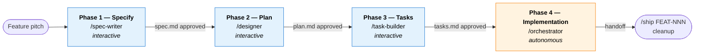
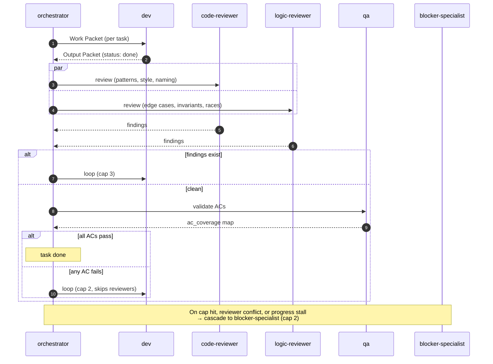

# ai-squad

**An opinionated Spec-Driven Development team for [Claude Code](https://www.claude.com/claude-code).**

Plug-and-play Skills + Subagents that run the full SDD pipeline: human-in-the-loop spec/plan/tasks drafting, then autonomous implementation with parallel reviewers, QA, and a clear escalation path. Bring your project — the squad brings the flow.

> **Status:** v0.1 — design-complete, contract-validated end-to-end via [`scripts/smoke-walkthrough.sh`](scripts/smoke-walkthrough.sh) (24/24 PASS). Not yet battle-tested in real repos at scale.

---

## Why

- **Claude Code ships primitives** (Skills, Subagents, the `Task` tool, `AskUserQuestion`) — not a workflow.
- **SDD ships a workflow** — but you'd rebuild the pipeline every project.
- **ai-squad is the missing layer:** 9 canonical Roles, 4 Phases, research-backed boundaries, runtime artifacts gitignored, 24-check smoke validation.

If you've used [GitHub Spec Kit](https://github.com/github/spec-kit) or [AWS Kiro](https://kiro.dev/), the shape will feel familiar — ai-squad is a Claude Code-native synthesis (see [§ Inspirations](#inspirations) for full credits).

---

## How it works



Each Skill, on completion, instructs the human exactly what command to run next — no need to memorize the flow. The first Skill (`/spec-writer`) asks via interactive checkbox which Phases will run for this Session — **any Phase can be skipped, including Phase 4 itself**.

## Phase 4 anatomy

The autonomous Implementation pipeline, per task. Capped concurrency = 5 (Anthropic empirical fan-out sweet spot). Async across tasks: one task escalating doesn't block parallels.



## Team — 9 canonical Roles

| Role | Phase | Type | Owns |
|------|-------|------|------|
| **spec-writer** | 1 — Specify | Skill | Feature request → approved Spec |
| **designer** | 2 — Plan | Skill | Spec → approved Plan (architecture, data, API, UX, risks) |
| **task-builder** | 3 — Tasks | Skill | Spec + Plan → granular Tasks with file scope and AC coverage |
| **orchestrator** | 4 — Implementation | Skill | Reads Spec/Plan/Tasks; dispatches Subagents; emits handoff |
| **dev** | 4 | Subagent | Implements one task; TDD-leaning; one atomic commit per task |
| **code-reviewer** | 4 | Subagent | Patterns, conventions, architectural fit (Google's Design+Style+Naming) |
| **logic-reviewer** | 4 | Subagent | Behavioral gaps vs Spec (edge cases, races, invariants) |
| **qa** | 4 | Subagent | Per-AC validation; populates `ac_coverage` map |
| **blocker-specialist** | 4 (escalation) | Subagent | Resolves blockers via decision memo, or escalates to human |

**4 Skills + 5 Subagents = 9 canonical Roles.**

---

## Quick start

```bash
git clone https://github.com/<your-handle>/ai-squad.git
cd ai-squad
./tools/deploy.sh
```

The deploy script copies Skills to `~/.claude/skills/` and Subagents to `~/.claude/agents/` — they become available in every Claude Code session, in any project.

Then, in a consumer project (with `.agent-session/` added to `.gitignore`):

```
/spec-writer "Your feature pitch in one paragraph"
```

## Workflow modes

| Mode | Phases checked | Outcome |
|------|---------------|---------|
| **Full run** (default) | Spec + Plan + Tasks + Implementation | Spec → Plan → Tasks → autonomous build → handoff |
| **Plan now, execute later** | Spec + Plan + Tasks (skip Implementation) | Session ends `paused` after Tasks. Resume with `/orchestrator FEAT-NNN --resume` |
| **Spec only** | Spec | Session enters `paused` after Specify. Useful for ticketing without full build |

**Power-user override** (skips the interactive prompt): `/spec-writer FEAT-042 --plan="specify,plan,tasks"`.

---

## Try before you bet

A complete walk-through of `FEAT-001 — Health check endpoint` lives at [`examples/FEAT-001-fake/`](examples/FEAT-001-fake/) — every artifact each Phase produces, plus a sample Phase 4 dispatch (Work Packet → Output Packet) and the final handoff message.

Validate the contracts hold:

```bash
./scripts/smoke-walkthrough.sh
# → 24 checks, all PASS
```

Asserts each Phase's output exists and parses, every Spec AC is mapped to ≥1 task, Output Packets validate against the canonical schema (via `ajv-cli` if `npx` is available), cross-references resolve.

## Repo layout

```
skills/        Claude Code Skills (run in main session, slash-invoked)
agents/        Claude Code Subagents (isolated context, dispatched by orchestrator)
templates/     Spec/Plan/Tasks (Markdown), Work/Output Packets (JSON), Session (YAML)
docs/          Glossary + 11 concept files (deep-dive)
examples/      Worked artifact set + cross-Phase contract validation
scripts/       Smoke walkthrough + helpers
tools/         deploy.sh — installs to ~/.claude/skills and ~/.claude/agents
```

---

## Operational model

**Recommended runtime model per Phase** (Skills inherit from main session — set with `/model`):

| Phase | Model | Why |
|-------|-------|-----|
| 1 — Specify | opus | Spec drafting is reasoning-heavy |
| 2 — Plan | opus | Architecture decisions are reasoning-heavy |
| 3 — Tasks | sonnet | Decomposition is more procedural |
| 4 — Orchestrator | sonnet (opus for fan-out planning) | Sequential dispatch + state management |

Subagent models are fixed per [`docs/concepts/effort.md`](docs/concepts/effort.md): Sonnet for most; Opus for `logic-reviewer` (behavioral reasoning) and `blocker-specialist` (high-stakes arbitration).

**Permissions:** Phase 4 Subagents declare `permissionMode: bypassPermissions` — Phase 4 is autonomous by design. Blast radius is bounded by defense-in-depth (per-Subagent `tools:` allowlist + per-task `scope_files` Hard rule + per-Role authority boundary), not by Claude Code's permission prompt. Run in a trusted feature branch; do NOT run in directories mixed with secrets or production credentials.

**Persistence:** All runtime artifacts (Spec/Plan/Tasks, Work/Output Packets, logs) live under `.agent-session/<task_id>/` in the consumer project — **must be gitignored**. After the human accepts the handoff, `/ship FEAT-NNN` removes the directory entirely. Long-term tracking belongs in Jira/Linear/GitHub PR descriptions; the orchestrator's handoff message is formatted (Conventional Commits + 4 fixed sections) to copy-paste cleanly into those systems.

**Project context:** Each consumer project injects its own context via the Work Packet's `project_context` field (stack, path to standards reference like `CLAUDE.md`). The Roles never reference a specific project — that information arrives at dispatch time.

---

## Deep dive

For the conceptual foundations and rationale behind every design decision:

- [`docs/glossary.md`](docs/glossary.md) — canonical vocabulary used across docs and Role files. **Read this first.**
- [`docs/concepts/`](docs/concepts/) — 11 concept files: `role`, `skill-vs-subagent`, `effort`, `spec`, `evidence`, `output-packet`, `work-packet`, `phase`, `pipeline`, `escalation`, `session`.

The git history is also intentionally readable — each commit corresponds to a build phase with a research-backed decision trail.

## Inspirations

ai-squad is a synthesis, not an invention. Each source shaped specific decisions:

| Source | Shaped |
|--------|--------|
| [GitHub Spec Kit](https://github.com/github/spec-kit) | `/specify`, `/clarify`, `/plan`, `/tasks` shape; `[P]` parallelization marker; per-US phase decomposition |
| [AWS Kiro](https://kiro.dev/) | Per-Phase approval gate (explicit affirmative mandated); per-task forward traceability |
| [Aider](https://aider.chat/) | One atomic Conventional Commit per task as `dev`'s commit cadence |
| [Anthropic — Building Effective Agents](https://www.anthropic.com/research/building-effective-agents) + [multi-agent research](https://www.anthropic.com/engineering/multi-agent-research-system) | Orchestrator-workers pattern; 3-5 fan-out as the empirical concurrency sweet spot |
| [Reflexion (Shinn et al., NeurIPS 2023)](https://arxiv.org/abs/2303.11366) | Retry caps and verbal feedback; ai-squad uses 3/2/2 (review/qa/blocker) |
| [Nygard ADR](https://github.com/joelparkerhenderson/architecture-decision-record) | 5-field memo schema (Title/Status/Context/Decision/Consequences) for blocker decisions |
| [Google Engineering Practices](https://google.github.io/eng-practices/review/reviewer/looking-for.html) | `code-reviewer` (Design+Style+Naming) vs `logic-reviewer` (Functionality+edge cases) split |
| [STRIDE](https://en.wikipedia.org/wiki/STRIDE_(security)) + [ATAM](https://www.sei.cmu.edu/library/architecture-tradeoff-analysis-method-collection/) | Fixed risk-category checklist (Security/Performance/Migration/Compat/Regulatory) in Plan |
| [INVEST](https://en.wikipedia.org/wiki/INVEST_(mnemonic)) + [SPIDR](https://www.mountaingoatsoftware.com/blog/five-simple-but-powerful-ways-to-split-user-stories) | Task-sizing heuristics: smallest independently testable slice, ~1 commit-worth |
| [Buck2](https://buck2.build/) | Single-coordinator pattern for `session.yml` sole-writer invariant in Phase 4 |

---

## Contributing

Issues and PRs welcome. Before opening a PR:

1. `./scripts/smoke-walkthrough.sh` → 24/24 PASS
2. `./tools/deploy.sh` → no length-budget warnings (Skill ≤ 300 lines, Subagent ≤ 150 lines)
3. If the change touches an artifact contract, update the corresponding `docs/concepts/` file to keep schema and prose aligned

## License

[MIT](LICENSE) — © 2026 Gabriel Andrade.
