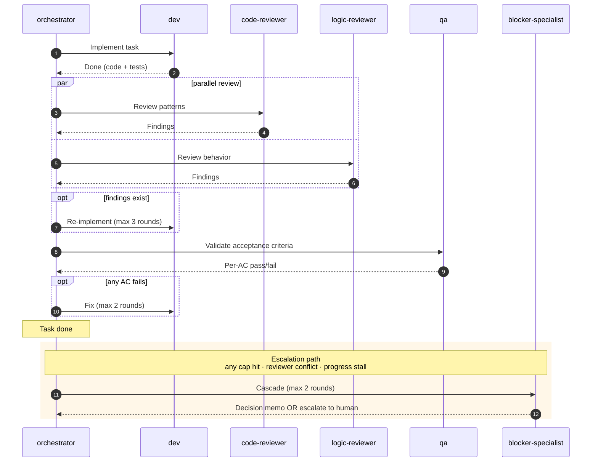
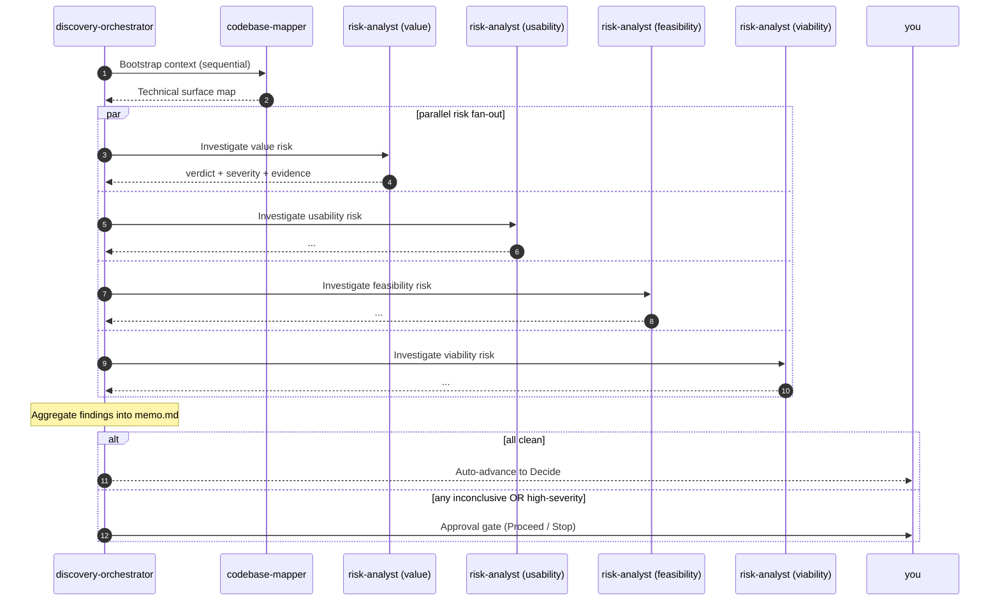

# ai-squad

     

> An opinionated multi-squad pipeline built for [Claude Code](https://claude.com/claude-code) — and portable to [Cursor](https://cursor.com) and [Kiro](https://kiro.dev) via dedicated deploy scripts.
>
> **Two squads ship today. You bring the problem signal or the pitch, ai-squad runs the right squad — pausing for your sign-off at every gate.**

```mermaid
flowchart LR
    Signal([Fuzzy problem]) --> DF
    Pitch([Clear pitch]) --> SS

    subgraph Discovery [<b>Discovery squad</b> — fuzzy → decision]
        DF[<b>Frame</b><br/>Cagan Q1-Q9]
        DI[<b>Investigate</b><br/>4× risk-analyst]
        DD[<b>Decide</b><br/>options + recommendation]
        DF --> DI --> DD
    end

    subgraph SDD [<b>SDD squad</b> — pitch → shipped code]
        SS[<b>Specify</b><br/>spec.md]
        SP[<b>Plan</b><br/>plan.md]
        ST[<b>Tasks</b><br/>tasks.md]
        SB[<b>Build</b><br/>code + tests]
        SS --> SP --> ST --> SB
    end

    DD -.you read memo.<br/>recompose pitch.-> SS
    SB --> Done([Handoff])

    classDef interactive fill:#e3f2fd,stroke:#1976d2,color:#000
    classDef autonomous fill:#fff3e0,stroke:#f57c00,color:#000
    class DF,DI,DD,SS,SP,ST interactive
    class SB autonomous
```

Every gate is conversational. Only SDD's Build phase runs unattended.

---

## Why

Working with AI on a real feature without a workflow is messy:

- You re-prompt the same context every session.
- The output doesn't quite match what you meant.
- Three days later you can't remember why a decision was made.

And before "build the feature" there's an older question: **should we even build this?** Skipping it is how careful code ends up shipping for nobody.

ai-squad gives you both layers:

🎯 **Discovery** — turn a fuzzy opportunity into a structured decision (build it / kill it / pivot / defer).
🚢 **SDD** — turn a clear pitch into shipped code, with explicit gates and autonomous quality checks.

## Install (deployment)

**Requirements:** Python 3.8+ on `PATH` (hook scripts). You use **either** [Claude Code](https://claude.com/claude-code), [Cursor](https://cursor.com), or [Kiro](https://kiro.dev) as the agent host — or any combination on the same machine (they install to different directories).

| Script | Host | What it does |
|--------|------|----------------|
| [`./tools/deploy.sh`](tools/deploy.sh) | **Claude Code** | Copies `squads/<squad>/skills/` → `~/.claude/skills/`, `agents/` → `~/.claude/agents/`, `hooks/*.py` → `~/.claude/hooks/`. Hooks are **wired in Skill/Subagent frontmatter** (orchestrator gets full PreToolUse + Stop; each subagent gets its Stop hook). |
| [`./tools/deploy-cursor.sh`](tools/deploy-cursor.sh) | **Cursor** | Exports every `skill.md` / `agents/*.md` to `~/.cursor/skills/<role>/SKILL.md` (via [`tools/cursor_export_skill.py`](tools/cursor_export_skill.py)), **always** syncs `squads/sdd/hooks/*.py` → `~/.cursor/hooks/ai-squad/`, then **merges** [`squads/sdd/hooks/cursor-hooks.json`](squads/sdd/hooks/cursor-hooks.json) into `~/.cursor/hooks.json` (backup + dedupe by `command`). Does **not** touch `~/.claude/`. |
| [`./tools/deploy-kiro.sh`](tools/deploy-kiro.sh) | **Kiro** | Converts every `skill.md` and `agents/*.md` → `~/.kiro/agents/<name>.json` (Kiro Custom Agent format, via [`tools/kiro_convert_agent.py`](tools/kiro_convert_agent.py)), syncs `hooks/*.py` → `~/.kiro/hooks/`. Skills become Custom Agents because Kiro's native Skills primitive can't carry hooks. Does **not** touch `~/.claude/`, `~/.cursor/`, or `~/.kiro/skills/`. |

```bash
git clone https://github.com/<your-handle>/ai-squad.git
cd ai-squad

# Claude Code — slash commands + subagents + per-component hooks
./tools/deploy.sh                    # all squads (default)
# or: ./tools/deploy.sh sdd
# or: ./tools/deploy.sh discovery

# Cursor — Skills picker + global hooks.json (see Cursor subsection below)
./tools/deploy-cursor.sh
# or: ./tools/deploy-cursor.sh sdd discovery

# Kiro — Custom Agents + per-agent hooks (see Kiro subsection below)
./tools/deploy-kiro.sh
# or: ./tools/deploy-kiro.sh sdd
# or: ./tools/deploy-kiro.sh sdd discovery
```

**Claude Code after `deploy.sh`:** run `/spec-writer`, `/discovery-lead`, etc. in any project — components live in `~/.claude/`.

**Cursor after `deploy-cursor.sh`:**

- Invoke the same workflows as in Claude Code with **`/spec-writer`**, **`/discovery-lead`**, **`/orchestrator`**, etc. (slash + skill name), **`@skill`**, or the **Skills** picker — see [Cursor Skills](https://cursor.com/docs/agent/chat/commands). Exported `SKILL.md` strips Claude-only frontmatter; the body matches the repo.
- **Hooks:** same Python sources as Claude; Cursor merge lists **only** hooks that are safe **globally** (`block-git-write`, `verify-audit-dispatch`, `verify-output-packet`). **`guard-session-scope`** is **not** merged (would block every `Write`, including `dev`). See [`squads/sdd/hooks/README.md`](squads/sdd/hooks/README.md).
- Env: `SKIP_CURSOR_HOOK_MERGE=1` skips merging `~/.cursor/hooks.json`. `CURSOR_SKILLS_DST` / `CURSOR_HOOKS_DST` override install paths. Manual merge: `python3 tools/merge_ai_squad_cursor_hooks.py`.

Cursor also supports loading **Claude-format** hook configs from `~/.claude/settings.json` when **Third-party skills** is enabled — that path is optional and separate from `deploy-cursor.sh`; see [Cursor third-party hooks](https://cursor.com/docs/reference/third-party-hooks).

**Kiro after `deploy-kiro.sh`:**

- Launch any ai-squad agent with `kiro-cli --agent <name>` (e.g. `kiro-cli --agent spec-writer`, `kiro-cli --agent orchestrator`, `kiro-cli --agent discovery-lead`). Inside an existing chat session, run `/agent` to open the picker and switch.
- **Tools:** the converter emits Kiro's canonical names (`read`, `write`, `shell`, `grep`, `glob`); legacy aliases like `fs_read` / `fs_write` / `execute_bash` are still accepted by Kiro CLI. `WebSearch` / `WebFetch` have no built-in equivalent — install an MCP server that provides them and reference via `@<server>/<tool>`.
- **Hooks:** same Python sources as Claude Code — `hook_runtime.py` already handles Kiro's `cwd` payload (no `CLAUDE_PROJECT_DIR` needed). All four hooks (`block-git-write`, `verify-audit-dispatch`, `verify-output-packet`, `guard-session-scope`) are wired **per-agent** inside each `.json` (not globally), so `guard-session-scope` is safe — it only fires for the orchestrator agent.
- **Models:** `sonnet`/`opus` agents map to `auto` (Kiro picks per task); `haiku` agents map to `claude-haiku-4.5`. Both are official Kiro `model_id`s (verified via `kiro-cli chat --list-models`). Edit the `MODEL_MAP` constant in [`tools/kiro_convert_agent.py`](tools/kiro_convert_agent.py) to pin specific versions when needed.
- **Skills primitive:** ai-squad does **not** install into `~/.kiro/skills/`. Kiro's native Skills are context resources without hook support, while ai-squad entry-points need hooks — so they map to Kiro Custom Agents instead. Your own `~/.kiro/skills/` content is untouched.
- Env: `KIRO_AGENTS_DST` / `KIRO_HOOKS_DST` override install paths.

### Host compatibility

Claude Code is the **source of truth**. Cursor and Kiro are translations via dedicated deploy scripts, with known trade-offs per host. Choose based on which guarantees you need.

| Capability | Claude Code | Cursor | Kiro CLI/IDE |
|---|---|---|---|
| **Skill invocation** | `/spec-writer`, `/discovery-lead`, … | `/<name>`, `@<name>`, picker | `kiro-cli --agent <name>` (shell), `/agent` picker (in-chat) |
| **Subagent dispatch** | `Task` tool, parallel fan-out | sequential (depends on build) | `delegate` tool, parallel |
| **Hook scope** | per-Skill / per-Subagent (frontmatter) | global merge into `~/.cursor/hooks.json` | per-agent inside each `.json` |
| **`block-git-write`** | ✅ orchestrator only | ✅ global | ✅ orchestrator only |
| **`verify-audit-dispatch`** | ✅ orchestrator only | ✅ global (skip-if-no-Phase-4) | ✅ orchestrator only |
| **`verify-output-packet`** | ✅ each Subagent | ✅ global | ✅ each agent |
| **`guard-session-scope`** | ✅ orchestrator only | ❌ **omitted** (would block `dev`) | ✅ orchestrator only |
| **`AskUserQuestion` tool** | native | numbered options / Yes-No in chat | native |
| **`bypassPermissions`** | native frontmatter | use `--trust-all-tools` | `allowedTools: ["*"]` |
| **`WebSearch` / `WebFetch`** | native | native | requires MCP server (`@<server>/<tool>`) |
| **Model aliases** | `sonnet` / `opus` / `haiku` | inherited from Cursor | `auto` / `claude-sonnet-4.5` / `claude-haiku-4.5` |

**Functional coverage**: Claude Code 100% · Cursor ~90% · Kiro ~95%
**Mechanical coverage (hooks)**: Claude Code 4/4 · Cursor 3/4 · Kiro 4/4

> Kiro's per-agent hook model lets `guard-session-scope` fire only for the orchestrator, closing the gap that forced Cursor to omit it globally. If you need full mechanical enforcement outside Claude Code, prefer Kiro.

## Pick the right squad

| Your situation | Run | Cost |
|---------------|-----|------|
| 🎯 You have a clear pitch | `/spec-writer "<your pitch>"` | 1 squad |
| 🤔 You have a fuzzy idea — not sure if/what to build | `/discovery-lead "<problem signal>"` | 1 squad (may end in "kill") |
| 🔁 Discovery decided "Proceed" — now build it | Read the memo, recompose your pitch, then `/spec-writer "<recomposed pitch>"` | Both squads chained |
| ❌ Discovery decided "Kill" | `/ship DISC-NNN` to clean up | Discovery only |

> **Why isn't the chain automatic?** Discovery memos can sit for weeks before delivery starts. Auto-feeding them silently propagates stale assumptions. Re-reading is your freshness check — quick, but deliberate.

---

## How each squad works

Each squad has one entry point per Phase. Invocation differs per host — same skill body, same artifacts:

- **Claude Code**: `/spec-writer`, `/discovery-lead`, …
- **Cursor**: `/<name>`, `@<name>`, or the Skills picker
- **Kiro**: `kiro-cli --agent <name>` from the shell, or `/agent` picker inside chat

Then follow the skill steps in order.

### 🎯 Discovery — when you don't yet know if/what to build

> 3 commands · 3 Phases · output is one `memo.md` you read before composing your SDD pitch.

| You run | The Skill does | Phase |
|---------|----------------|-------|
| `/discovery-lead "<problem>"` | Walks you through an interactive interview to fill in a 1-pager | 1 — **Frame** |
| `/discovery-orchestrator DISC-NNN` | Runs 5 background analyses (1 codebase mapper + 4 risk analysts in parallel). Interrupts you only if findings need attention | 2 — **Investigate** |
| `/discovery-synthesizer DISC-NNN` | Presents your options (kill always included) + a recommendation. You make the final call | 3 — **Decide** |

**One line each:**

> 💬 **discovery-lead:** "let's talk through a 1-pager about this opportunity."
> ⚙️ **discovery-orchestrator:** "I'll run 5 background analyses and bring you the findings."
> 🎯 **discovery-synthesizer:** "here are your options, I recommend #2 — you decide."

### 🚢 SDD — when you know what to build

> 4 commands · 4 Phases · output is shipped code in your repo.

| You run | The Skill does | Phase |
|---------|----------------|-------|
| `/spec-writer "<pitch>"` | Walks you through writing the Spec — problem, user stories, acceptance criteria | 1 — **Specify** |
| `/designer FEAT-NNN` | Walks you through architecture and design decisions | 2 — **Plan** |
| `/task-builder FEAT-NNN` | Walks you through breaking the Plan into granular Tasks | 3 — **Tasks** |
| `/orchestrator FEAT-NNN` | Runs the autonomous build (dev → reviewers → qa, in parallel where possible) and emits one handoff at the end | 4 — **Build** |

**One line each:**

> 💬 **spec-writer:** "let's write the Spec for this feature."
> 🏗️ **designer:** "let's decide the architecture."
> 📋 **task-builder:** "let's break this into tasks."
> 🤖 **orchestrator:** "I'll run the build and tell you when it's done."

---

## See it work

End-to-end worked examples (every artifact, every dispatch packet, every handoff message):

- 🎯 [`examples/discovery-DISC-001-fake/`](examples/discovery-DISC-001-fake/) — *"Real-time notifications for support tickets"*
- 🚢 [`examples/sdd-FEAT-001-fake/`](examples/sdd-FEAT-001-fake/) — *"/health endpoint"*

To verify the pipeline contracts hold:

```bash
./scripts/smoke-walkthrough.sh
```

59 checks across both squads. All pass.

---

<details>
<summary><b>👥 The team — 14 specialists across 2 squads</b></summary>

<br/>

ai-squad is 15 canonical Roles split across 2 squads. Each Role is one file (Skill = conversational with you; Subagent = autonomous worker dispatched by an orchestrator).

**🎯 Discovery squad — 5 Roles:**

| Role | Phase | What it owns |
|------|-------|--------------|
| **discovery-lead** | 1 — Frame | Drafting the 1-pager interactively with you |
| **discovery-orchestrator** | 2 — Investigate | Dispatching codebase-mapper + 4× risk-analyst; conditional approval gate |
| **codebase-mapper** | 2 | Read-only "code spelunking" producing a map of the technical surface |
| **risk-analyst** | 2 | Multi-instance — one dispatch per Cagan Big Risk (value/usability/feasibility/viability) |
| **discovery-synthesizer** | 3 — Decide | Generating options + recommendation; conducting the approval gate |

**🚢 SDD squad — 10 Roles:**

| Role | Phase | What it owns |
|------|-------|--------------|
| **spec-writer** | 1 — Specify | Turning your pitch into an approved Spec |
| **designer** | 2 — Plan | Turning the Spec into a Plan (architecture, data, API, UX, risks) |
| **task-builder** | 3 — Tasks | Turning the Plan into granular Tasks |
| **orchestrator** | 4 — Build | Reading everything, dispatching workers in parallel, emitting one handoff |
| **dev** | 4 | Implementing one task; test-first; changes stay unstaged for human review |
| **code-reviewer** | 4 | Patterns, style, naming, architectural fit |
| **logic-reviewer** | 4 | Edge cases, race conditions, missing flows |
| **qa** | 4 | Validating each acceptance criterion is actually satisfied |
| **blocker-specialist** | 4 (escalation) | Resolving blockers via decision memo, or escalating to you. Reusable cross-squad |
| **audit-agent** | 4 (pre-handoff gate) | Reconciling the dispatch manifest against actual outputs; refuses handoff if pipeline was bypassed |

</details>

<details>
<summary><b>⚙️ SDD Build phase — what runs autonomously</b></summary>

<br/>



Up to 5 tasks run in parallel. Async by design — one task escalating doesn't block the others.

</details>

<details>
<summary><b>🔍 Discovery Investigate phase — sequential bootstrap, then parallel risk fan-out</b></summary>

<br/>



No retry loops — Discovery is timeboxed by design. `inconclusive` is a first-class outcome, not an error. Each risk-analyst can return `N/A` when a risk doesn't apply (e.g. `viability` for internal tooling).

</details>

<details>
<summary><b>📂 Repo layout</b></summary>

<br/>

```
squads/
  discovery/               🎯 Discovery squad (Frame → Investigate → Decide)
    skills/                3 conversational Skills
    agents/                2 autonomous Subagents
    templates/             memo template
  sdd/                     🚢 SDD squad (Specify → Plan → Tasks → Implementation)
    skills/                4 conversational Skills
    agents/                5 autonomous Subagents
    templates/             spec / plan / tasks templates
shared/                    Cross-squad assets (concepts, schemas, glossary, packets, session)
examples/                  Worked examples (one per squad)
docs/                      Inspirations, operational model
scripts/                   smoke-walkthrough.sh, smoke-cursor-export.sh, smoke-kiro-export.sh
tools/                     deploy.sh, deploy-cursor.sh, deploy-kiro.sh, merge_ai_squad_cursor_hooks.py, cursor_export_skill.py, kiro_convert_agent.py
```

</details>

---

## Learn more

- 📖 [`docs/inspirations.md`](docs/inspirations.md) — the industry sources that shaped each decision
- 🔧 [`docs/operational-model.md`](docs/operational-model.md) — recommended Claude models per Phase, permissions, persistence
- 📚 [`shared/glossary.md`](shared/glossary.md) — canonical vocabulary

## Contributing

PRs welcome. Before opening: `./scripts/smoke-walkthrough.sh` should still PASS, `./scripts/smoke-cursor-export.sh` should PASS, `./scripts/smoke-kiro-export.sh` should PASS, and `./tools/deploy.sh` should report no length-budget warnings.

---

[MIT](LICENSE) — © 2026 Gabriel Andrade
