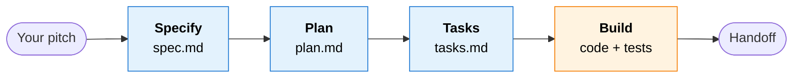
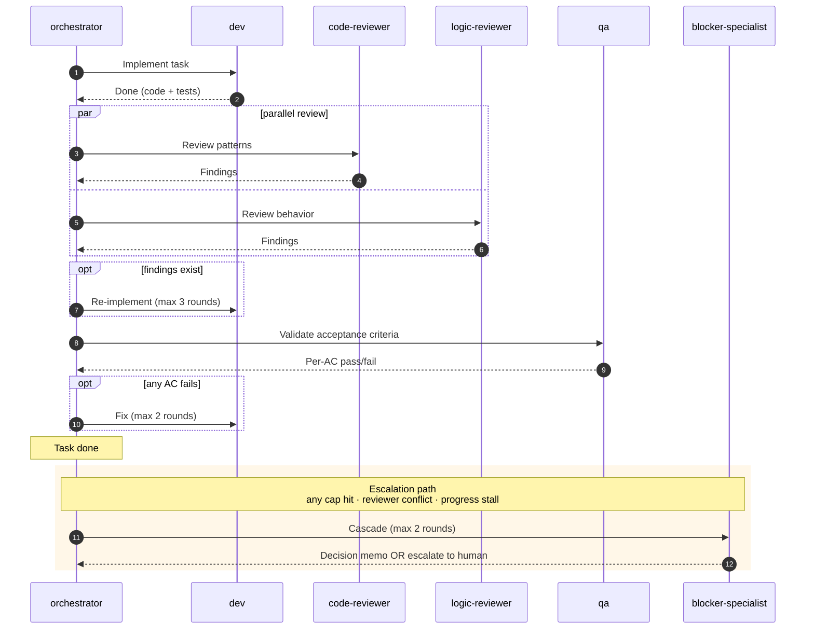

# ai-squad

> An opinionated SDD (Spec-Driven Development) pipeline for [Claude Code](https://claude.com/claude-code).
>
> **You write the pitch. ai-squad writes the spec, plans the build, splits the work into tasks, and ships the code — pausing for your sign-off between phases.**



The first 3 steps are conversational with you. The 4th runs on its own — implementing, reviewing, testing, escalating only when it can't decide.

`v0.1 — design-complete, 24/24 smoke checks PASS, MIT licensed`

---

## Why

Without a workflow, working with Claude Code on a real feature feels like:

- Re-prompting the same context every session.
- Getting code that doesn't quite match what you meant.
- Losing track of why a decision was made three days later.

ai-squad gives you the missing layer: **a structured pipeline with explicit approval gates, then autonomous implementation with quality checks**. It's a synthesis of [GitHub Spec Kit](https://github.com/github/spec-kit), [AWS Kiro](https://kiro.dev), [Aider](https://aider.chat), and patterns from Anthropic's [Building Effective Agents](https://www.anthropic.com/research/building-effective-agents).

## Install in 30 seconds

```bash
git clone https://github.com/<your-handle>/ai-squad.git
cd ai-squad
./tools/deploy.sh
```

This copies the commands into your `~/.claude/` so they're available in every Claude Code session, in any project.

## Use it

In any project (with `.agent-session/` in your `.gitignore`):

```
/spec-writer "I want to add a /health endpoint to the API"
```

That's it. The command walks you through the whole flow and tells you what to type next at each step.

## Pick your mode

When you start, a checkbox lets you pick which phases to run. Skip any of them, including the autonomous build.

| Mode | What runs | When to use |
|------|-----------|-------------|
| **Full** | Spec → Plan → Tasks → Build | Default. Real features. |
| **Plan now, build later** | Spec → Plan → Tasks | You want the artifacts now and will run the build separately. |
| **Spec only** | Spec | You're writing a ticket and don't need ai-squad to build it. |

## See it work end-to-end

[`examples/FEAT-001-fake/`](examples/FEAT-001-fake/) — a complete walk-through of a real feature ("/health endpoint"). Every artifact each phase produces, the dispatch packets, the final handoff message.

To verify the pipeline contracts hold:

```bash
./scripts/smoke-walkthrough.sh
```

24 checks. All pass.

---

<details>
<summary><b>The team — 9 specialists</b></summary>

<br/>

ai-squad is 9 canonical roles: 4 conversational (the first 3 phases + the orchestrator) and 5 autonomous workers (everyone in Phase 4).

| Role | Phase | What it owns |
|------|-------|--------------|
| **spec-writer** | 1 | Turning your pitch into an approved Spec |
| **designer** | 2 | Turning the Spec into a Plan (architecture, data, API, UX, risks) |
| **task-builder** | 3 | Turning the Plan into granular Tasks with file scope and acceptance criteria |
| **orchestrator** | 4 | Reading everything, dispatching workers in parallel, emitting one handoff |
| **dev** | 4 | Implementing one task; test-first; one commit per task |
| **code-reviewer** | 4 | Patterns, style, naming, architectural fit |
| **logic-reviewer** | 4 | Edge cases, race conditions, missing flows, broken invariants |
| **qa** | 4 | Validating each acceptance criterion is actually satisfied |
| **blocker-specialist** | 4 (escalation) | Resolving blockers via decision memo, or escalating to you |

</details>

<details>
<summary><b>Phase 4 anatomy — what happens during the autonomous build</b></summary>

<br/>



Up to 5 tasks run in parallel. Async by design — one task escalating doesn't block the others.

</details>

<details>
<summary><b>Operational model — models, permissions, persistence</b></summary>

<br/>

**Recommended Claude model per phase:**

| Phase | Model | Why |
|-------|-------|-----|
| 1 — Specify | opus | Spec drafting is reasoning-heavy |
| 2 — Plan | opus | Architecture decisions are reasoning-heavy |
| 3 — Tasks | sonnet | Decomposition is more procedural |
| 4 — Orchestrator | sonnet (opus for complex fan-out) | Sequential dispatch + state management |

Subagent models are fixed in their definitions per [`docs/concepts/effort.md`](docs/concepts/effort.md).

**Permissions:** Phase 4 workers run in `bypassPermissions` mode (autonomous by design). Safety comes from defense-in-depth: per-worker tool allowlists, per-task file scope, per-role authority boundaries. Run on a feature branch you'd normally review before merging — never in a directory mixed with secrets.

**Persistence:** All artifacts live under `.agent-session/<task_id>/` in your project (gitignored). After you accept the handoff, `/ship FEAT-NNN` deletes the directory. Long-term tracking belongs in Jira/Linear/GitHub PR descriptions — the handoff message is formatted to copy-paste cleanly into those.

</details>

<details>
<summary><b>Repo layout</b></summary>

<br/>

```
skills/        Claude Code Skills (run in main session, slash-invoked)
agents/        Claude Code Subagents (isolated context, dispatched by orchestrator)
templates/     Spec/Plan/Tasks (Markdown), Work/Output Packets (JSON), Session (YAML)
docs/          Glossary + 11 concept files (the deep dive)
examples/      Worked artifact set (FEAT-001-fake)
scripts/       smoke-walkthrough.sh
tools/         deploy.sh
```

</details>

<details>
<summary><b>Conceptual foundations</b> — for the "why" behind every decision</summary>

<br/>

- [`docs/glossary.md`](docs/glossary.md) — canonical vocabulary used across docs and role files. **Read this first.**
- [`docs/concepts/`](docs/concepts/) — 11 concept files: `role`, `skill-vs-subagent`, `effort`, `spec`, `evidence`, `output-packet`, `work-packet`, `phase`, `pipeline`, `escalation`, `session`.

The git history is intentionally readable — each commit corresponds to a build phase with a research-backed decision trail.

</details>

<details>
<summary><b>Inspirations</b> — sources that shaped specific decisions</summary>

<br/>

ai-squad is a synthesis, not an invention. Each source shaped a specific decision (cited inline in commits and concept docs):

| Source | Shaped |
|--------|--------|
| [GitHub Spec Kit](https://github.com/github/spec-kit) | `/specify`, `/clarify`, `/plan`, `/tasks` shape; `[P]` parallelization marker; per-user-story decomposition |
| [AWS Kiro](https://kiro.dev) | Per-phase approval gate; per-task forward traceability |
| [Aider](https://aider.chat) | One atomic Conventional Commit per task |
| [Anthropic — Building Effective Agents](https://www.anthropic.com/research/building-effective-agents) + [multi-agent research](https://www.anthropic.com/engineering/multi-agent-research-system) | Orchestrator-workers pattern; 3-5 parallel workers as the empirical sweet spot |
| [Reflexion (Shinn et al., NeurIPS 2023)](https://arxiv.org/abs/2303.11366) | Retry caps and verbal feedback; ai-squad uses 3/2/2 (review/qa/blocker) |
| [Nygard ADR](https://github.com/joelparkerhenderson/architecture-decision-record) | 5-field memo schema for blocker decisions |
| [Google Engineering Practices](https://google.github.io/eng-practices/review/reviewer/looking-for.html) | code-reviewer (patterns) vs logic-reviewer (behavior) split |
| [STRIDE](https://en.wikipedia.org/wiki/STRIDE_(security)) + [ATAM](https://www.sei.cmu.edu/library/architecture-tradeoff-analysis-method-collection/) | Fixed risk-category checklist in Plan |
| [INVEST](https://en.wikipedia.org/wiki/INVEST_(mnemonic)) + [SPIDR](https://www.mountaingoatsoftware.com/blog/five-simple-but-powerful-ways-to-split-user-stories) | Task-sizing heuristics |
| [Buck2](https://buck2.build/) | Single-coordinator pattern for state |

</details>

<details>
<summary><b>Contributing</b></summary>

<br/>

PRs welcome. Before opening:

1. `./scripts/smoke-walkthrough.sh` → 24/24 PASS
2. `./tools/deploy.sh` → no length-budget warnings (Skill ≤ 300 lines, Subagent ≤ 150 lines)
3. If you change an artifact contract, update the corresponding file in `docs/concepts/` to keep schema and prose aligned

</details>

---

[MIT](LICENSE) — © 2026 Gabriel Andrade
